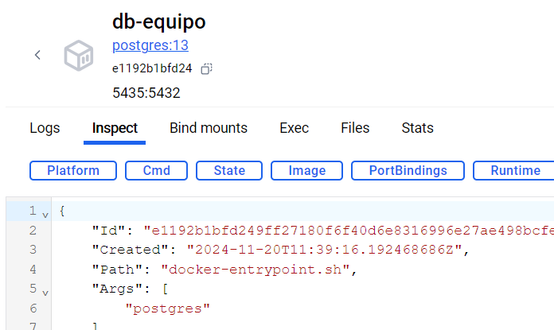
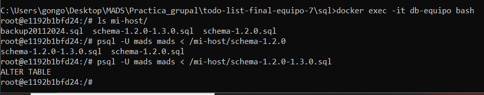

# MADS - Práctica 4 #

**Equipo 7: Gonzalo Martín Zapata López, Cristian Andrés Córdoba Silvestre y Daniel Ripoll Sánchez**

## Enlaces ##

### Repositorio de GitHub ###
[https://github.com/mads2024-2025/todo-list-final-equipo-7.git](https://github.com/mads2024-2025/todo-list-final-equipo-7.git)

### Repositorio de DockerHub ###
[https://hub.docker.com/r/zaplog13/mads-todolist-equipo-7](https://hub.docker.com/r/zaplog13/mads-todolist-equipo-7)

## Cambios introducidos en la aplicación ##

### Nuevo atributo Tipo en la clase Equipo ###

#### Implementación ####

Para cumplir con el requisito de afectar a alguna entidad, se ha añadido un nuevo atributo a la clase `Equipo` llamado `tipo` de tipo `String`.

A partir de este atributo, se ha implementado la funcionalidad de poder filtrar los equipos a partir de su tipo. Existen 4 tipos de equipos: `Desarrollo`, `Diseño`, `Marketing` y `Administración`.

Para implementar esta funcionalidad se ha modificado `EquipoService` añadiendo un nuevo método llamado `filtrarEquiposPorTipo()`, que recibe como parámetro el tipo de equipo y devuelve una lista con los equipos que coincidan con dicho tipo.

Además de esto, se ha modificado el controlador `EquipoController` para que pueda manejar la petición GET de `listadoEquipos()` pero ahora con un parámetro opcional `tipo` que se utilizará para filtrar los equipos.

Asimismo, se ha modificado la vista `equipos.html` para que muestre un desplegable con los tipos de equipos y se pueda filtrar por ellos.

Por último, se han modificado las funcionalidades de crear Equipo y editar Equipo por parte del administrador para que ahora incluyan también el tipo del Equipo.

#### Tests ####
Para verificar que la implementación funciona correctamente a nivel de servicio, se ha implementado el test `filtrarEquiposPorTipo()` en la clase `EquipoServiceTest`.

Además, para comprobar que la implementación funciona a nivel de controlador, se ha creado el test `listaEquiposFiltrados` en la clase `EquipoWebTest`.

Por último, se han modifcado los tests correspondientes de crear y editar `Equipo` para que ahora se contemple también el tipo del `Equipo`.

### Opción para cambiar la contraseña del usuario ###
#### Implementación ####
Para permitir que el usuario cambie su contraseña una vez haya iniciado sesión, se ha implementado la vista `cuenta.html`, donde se muestra un pequeño formulario para realizar este cambio.

Primero, se creó un nuevo método en el servicio `UsuarioService` llamado `cambiarContrasena()`, que recibe como parámetros el ID del usuario y la nueva contraseña. Este servicio utiliza el setter del modelo de usuario para actualizar la contraseña.

Para manejar las peticiones HTTP, se creó un controlador llamado `CuentaController`, que permite tanto mostrar el HTML de la página de cuenta como procesar las solicitudes POST necesarias para cambiar la contraseña con la ayuda del servicio.

#### Tests ####
Para comprobar que la implementación funciona a nivel de servicio correctamente, se ha implementado el test `cambiarContrasenaUsuario()` en la clase `UsusarioServiceTest`.

Además, para comprobar que la implementación funciona a nivel de controlador, se ha creado el test `cambiarContraseniaTest()` en la clase `CuentaWebTest`.

### Opción para cambiar el nombre del usuario ###
#### Implementación ####

Para permitir que el usuario cambie su nombre una vez haya iniciado sesión, se ha implementado la opción en la vista `cuenta.html`, donde se muestra un pequeño formulario para realizar este cambio.

Primero, hemos creado un nuevo método en el servicio `UsuarioService` al cual hemos llamado `cambiarNombre()`, que recibe como parámetros el ID del usuario y el nuevo nombre. Este servicio utiliza el setter del modelo de usuario para actualizar el nombre.

Para manejar las peticiones HTTP, se creó un nuevo método del controlador `CuentaController` , que permite procesar las solicitudes POST necesarias para cambiar el nombre con la ayuda del servicio.

#### Tests ####

Para comprobar que la implementación funciona correctamente a nivel de servicio, se ha implementado el test `cambiarNombreUsuario()` en la clase `UsusarioServiceTest`.

Además, para verificar que la implementación funciona a nivel de controlador, se ha creado el test `cambiarNombreTest()` en la clase `CuentaWebTest`.

### Refactorizaciones ###
#### Implementación ####

Se han realizado dos refactorizaciones con el fin de mejorar la calidad del código implementado. Cada una de ellas se realizó en issues distintos.

*Refactirizando: Extract Class en HomeController*:
Se refactorizó uno de los controladores ya que este contaba con demasiadas responsabilidades. Se extrajo la clase `CuentaController` de `HomeController`, con el fin de manejar todas las rutas referentes al perfil.

*Refactorización: Contraseña con asteriscos*:
Tras la implementación y cierre del issue `Permtir que el usuario pueda cambiar la contraseña` se realizó una pequeña modificación en la vista para que la introducción de la nueva contraseña sea igual que en login y en el registro, donde no se pueden visualiazr los caracteres introducidodos.

## Despliegue en producción ##

El despliegue a producción lo hemos hecho en el ordenador de Gonzalo. En el documento `sql/historial.txt` se pueden ver alguno de los comandos usados, pero no estan todos aquellos que se han usado dentro de algún contenedor de docker. Los más interesantes a la hora del release de la versión 1.3.0 fueron los siguientes:

*docker inspect db-equipo*:
Este comando nos ha servido para saber cual es la ip del contenedor y poder conectarlo correctamente con el contendor con el aplicativo.

*docker run --name todolist-equipo-7_1-3-0 -p 8080:8080 zaplog13/mads-todolist-equipo-7:1.3.0 --spring.profiles.active=postgres --POSTGRES_HOST=172.17.0.2 --POSTGRES_PORT=5432*:
Este comando crea y corre nuestra aplicación, basada en la imagen creada con el comando *docker build*. La ip usada es la encontrada con el anterior comando.

### Esquema BBDD 1.2.0 ###

Podemos ver el esquema en `sql/schema-1.2.0.sql`. Este esquema tiene algunas diferencias con los esquemas de otros compañeros en la práctica, ya que usamos como base la práctica 3 de Cristian, el cual añadio varios campos tales como las horas a las tareas, el promedio de tareas a los usuarios o la entidad recursos.

### Esquema BBDD 1.3.0 ###

Podemos ver el esquema en `sql/schema-1.3.0.sql`. La única diferencia es la adición del atributo `tipo` a la entidad `equipos`. Se puede encontrar fácilmente con el comando `diff schema-1.2.0.sql schema-1.3.0.sql`.

### Script de migración ###

Ya que la diferencia es únicamente en 1 campo, el script de migración es muy simple. Este script fue ejecutado en el contenedor `db-equipo`, alterando la entidad equipo y añadiendo el atributo `tipo`. Como podemos ver en las fotos, el script de migración fue ejecutado en el contenedor que fue creado el dia 20 de noviembre.

